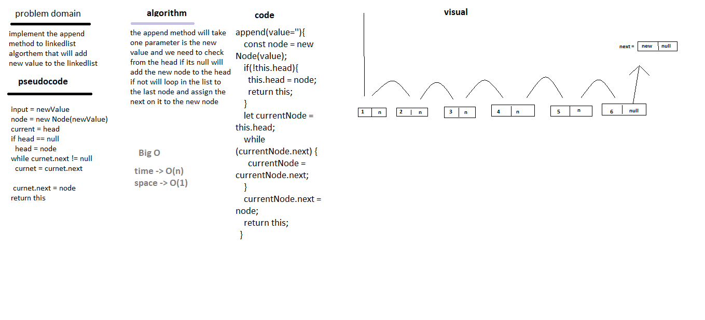
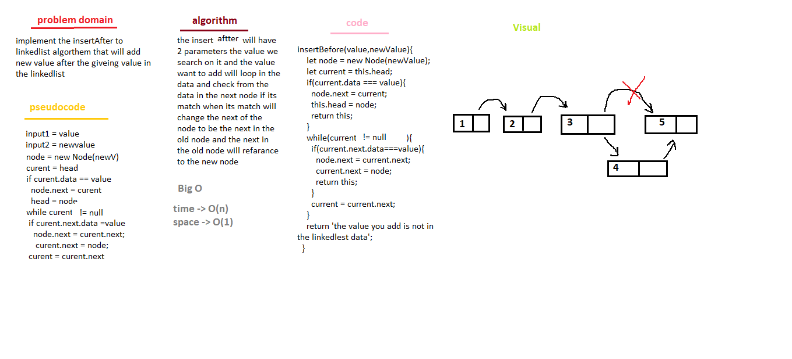
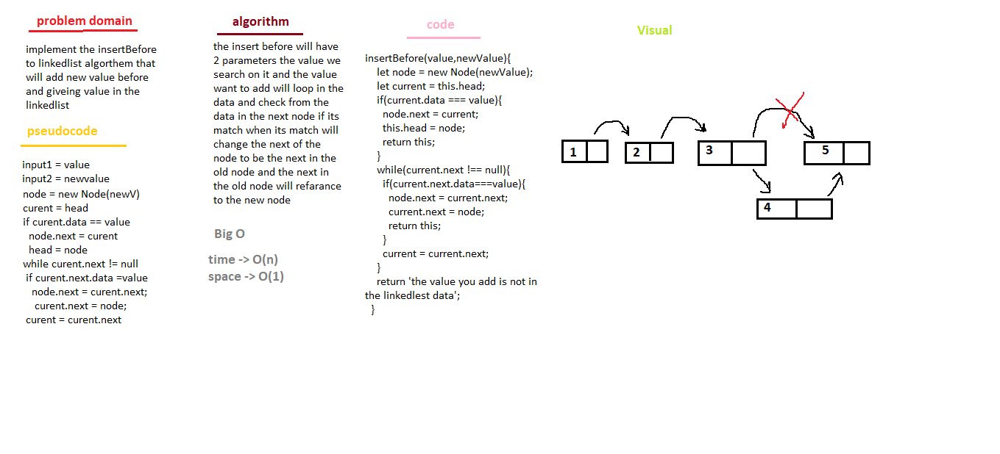

# Singly Linked List
I did some data structures in last year

## Challenge
the challenge is to make linked list data structures have 3 mthod 
1. append -> to add the node to the data
2. includes -> to search on some value and return boolean
3. toString -> to show all the data as a chain in string type end with null
4. insertAfter -> to add node after the value passed
5. insertBefore -> to add node before the value passed

## Approach & Efficiency
we use while loop in all methods cuase i want to check on where is the node end while we dont know how many item on it 
space -> O(n)
time -> Θ(1)

## API

1. insert -> to add the node to the data
2. includes -> to search on some value and return boolean
3. toString -> to show all the data as a chain in string type end with null
4. insertAfter -> to add node after the value passed
5. insertBefore -> to add node before the value passed

## Whiteboard

*`append`*

*`insertAfter`*

*`insertBefore`*

