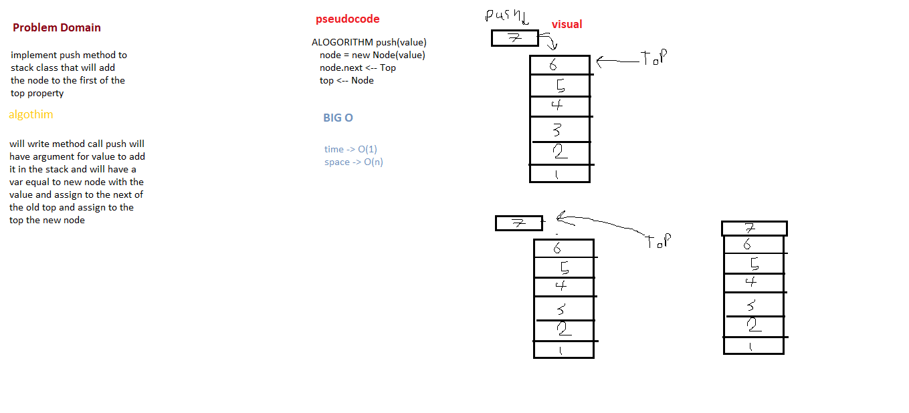
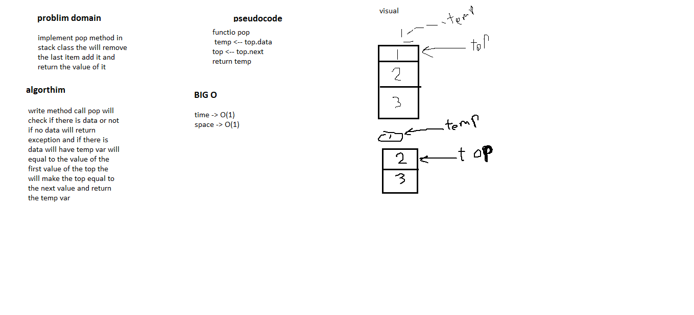

# Stack & Queue

## Stack

### Challenge

the challenge is to make *Stack* data structures have these mthods
1. push -> to add at first to the stack value  
2. pop -> will remove the last value add it and return it
3. peek -> will return the last value add it
4. isEmpty -> will boolean if its empty

### API

1. push -> to add at first to the stack value  
2. pop -> will remove the last value add it and return it
3. peek -> will return the last value add it
4. isEmpty -> will boolean if its empty

*push*

*pop*

## Queue

### Challenge

the challenge is to make *Queue* data structures have these mthods
1. enqueue -> to add at last to the queue value  
2. dequeue -> will remove the first value add it and return it
3. peek -> will return the first value add it
4. isEmpty -> will boolean if its empty

### API

1. enqueue -> to add at last to the queue value  
2. dequeue -> will remove the first value add it and return it
3. peek -> will return the first value add it
4. isEmpty -> will boolean if its empty

*enqueue*

*dequeue*
