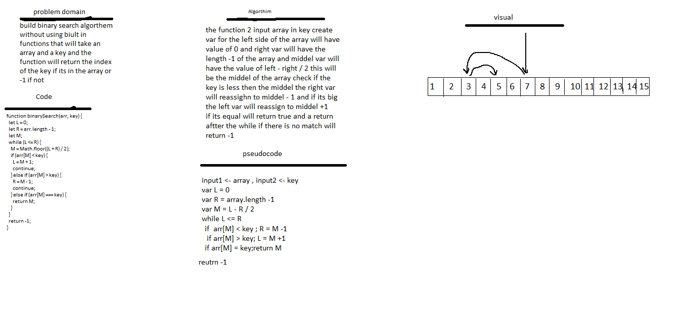
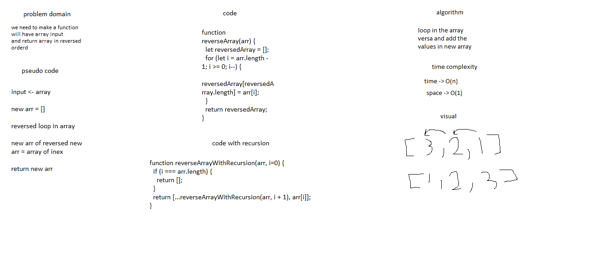

# 401 Code Challenges

## code-challenge PR 

[code-challenge-01](https://github.com/YazanAlaiwah-401-advanced-javascript/data-structures-and-algorithms/pull/6)

[code-challenge-05](https://github.com/YazanAlaiwah-401-advanced-javascript/data-structures-and-algorithms/pull/4)

<!-- # Array Shift

i know some biult in function will make easyer but its not allow so i use just loop

## Challenge

the challenge is to add and remove middel elements without using and biuld in functions

## Approach & Efficiency

the time complexity id O(1)

## Solution

# Reverse an Array

I know for loop and Recursion before

## Challenge

the challenge is to make array reversed using for and Recursion without biult in functions

## Approach & Efficiency

the time complexity id O(1)

## Solution

 -->
