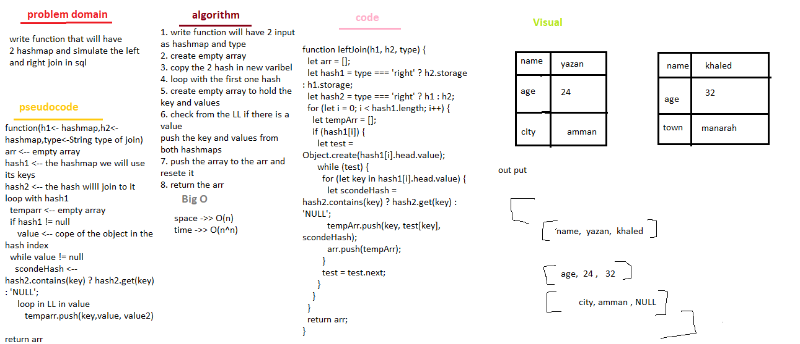

# LEFTJOIN

<!-- I did some data structures in last year -->

## Challenge

is to simulate the left join and right join in 2 hashmaps

## Approach & Efficiency

<!-- we use while loop in the childes cause we push to the array and want to check from its empty -->

space -> O(n)
time -> Θ(n^n)

### UML

