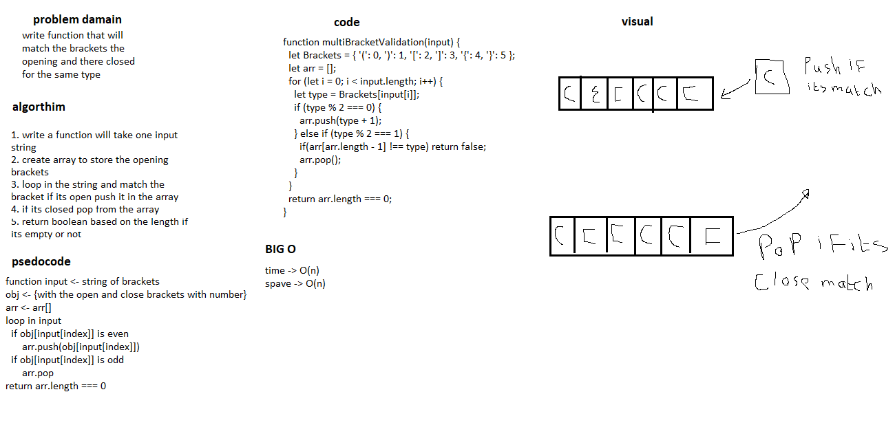

# Multi bracket validation
i have some knowledge with this question before 

## Challenge
build function will match the open/closed brackets 

## Approach & Efficiency
i will use while loop to check if the open bracket have a close bracket in the string

<!-- ## API -->

## Whiteboard
