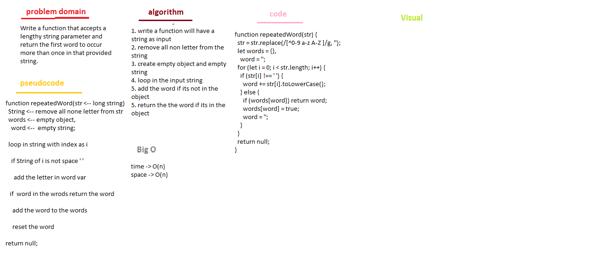

# Repated Word

## Challenge

Write a function that accepts a lengthy string parameter and return the first word to occur more than once in that provided string.

## Approach & Efficiency

space -> O(n)
time -> Θ(n)

### UML

