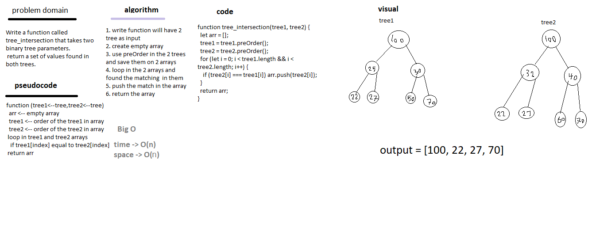

# TREE_INTERSECTION

<!-- I did some data structures in last year -->

## Challenge

Write a function called tree_intersection that takes two binary tree parameters.
return a set of values found in both trees.

## Approach & Efficiency

space -> O(n)
time -> Θ(n)

### UML

